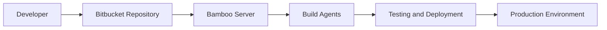
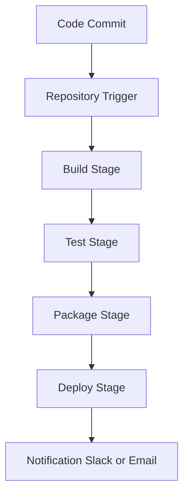
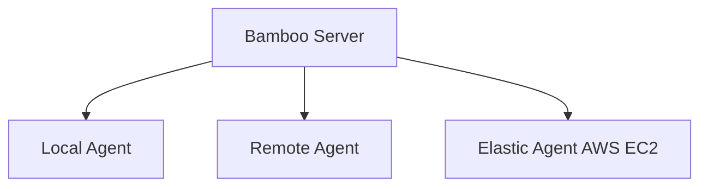
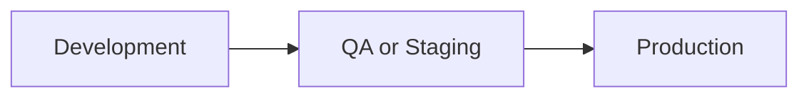
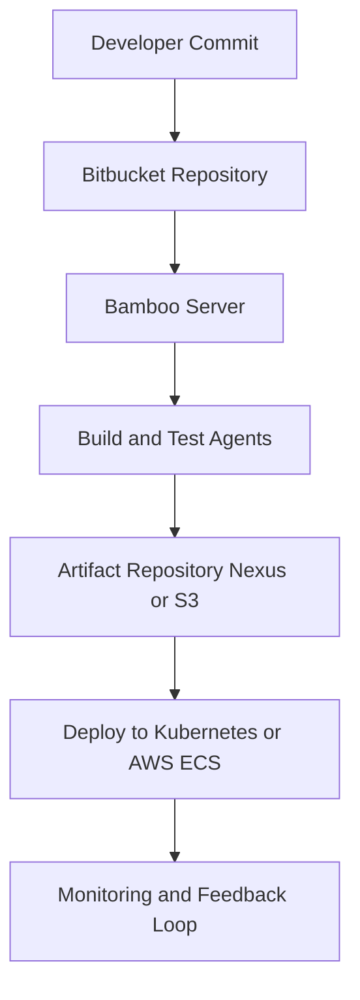

# 🧩 Bamboo CI/CD – Complete Beginner to Advanced Practical Guide (DevOps Perspective)

> **Author:** Shivam Malviya  
> **Last Updated:** 2025-10-08  
> **Version:** 2.1 (Fixed Mermaid Compatibility)

---

## 🏁 Part 1: Introduction to Bamboo

| Concept | Description | Example |
|----------|--------------|----------|
| **What is Bamboo?** | Atlassian’s CI/CD tool for automating code build, test, and deployment pipelines. | Automatically build & deploy a Java web app after every commit. |
| **CI/CD Meaning** | Continuous Integration (CI) ensures frequent code integration; Continuous Delivery (CD) automates deployment. | Jenkins, GitLab CI, and Bamboo are popular tools. |
| **Why Bamboo?** | Tight integration with Atlassian products (Bitbucket, JIRA, Confluence) and scalable agent-based architecture. | Build results automatically linked to JIRA issues. |

---

## ⚙️ Part 2: Bamboo Architecture Overview



| Component | Function | Example |
|------------|-----------|----------|
| **Bamboo Server** | Central CI/CD management system | Runs on `bamboo.company.com` |
| **Agent** | Executes builds and deployments | Local VM, Docker container, or AWS EC2 |
| **Plan** | Defines build pipeline | “Build and Deploy Spring App” |
| **Stage / Job / Task** | Logical workflow levels | “Build” → “Test” → “Deploy” |

---

## 🧱 Part 3: Installation and Setup

| Step | Action | Example |
|------|---------|----------|
| 1 | Install Java (required) | `sudo apt install openjdk-11-jdk` |
| 2 | Download Bamboo | [Atlassian Download Page](https://www.atlassian.com/software/bamboo/download) |
| 3 | Configure Database | Supports MySQL / PostgreSQL |
| 4 | Start Bamboo Server | `./start-bamboo.sh` |
| 5 | Access UI | `http://localhost:8085` |
| 6 | Configure License & Admin | Atlassian account setup |

---

## 🧩 Part 4: How a Bamboo Build Plan Works



| Stage | Description | Example |
|--------|-------------|----------|
| **Code Checkout** | Pulls code from repo | Bitbucket, GitHub |
| **Build** | Compile code | `mvn clean package` |
| **Test** | Run unit/integration tests | JUnit, pytest |
| **Package** | Create artifact | `.jar`, `.war`, `.zip` |
| **Deploy** | Push artifact | AWS, Docker, Kubernetes |

---

## 🧠 Part 5: Creating a Build Plan (Step-by-Step)

| Step | Action | Description |
|------|---------|-------------|
| 1 | Create New Plan | “SpringApp-Build” |
| 2 | Connect Repo | Bitbucket / GitHub |
| 3 | Add Stages | Build → Test → Deploy |
| 4 | Add Jobs & Tasks | “Run Maven Goal” → `clean install` |
| 5 | Add Deployment Project | Deploy to AWS EC2 |
| 6 | Save & Run | Bamboo triggers pipeline |

---

## 🧩 Part 6: Bamboo Agents (Execution Layer)



| Type | Description | Example Use |
|-------|-------------|--------------|
| **Local Agent** | Runs on Bamboo Server | Small projects |
| **Remote Agent** | External machine | Distributed builds |
| **Elastic Agent** | AWS EC2 Auto-scaling | Heavy CI/CD load |

---

## 🧮 Part 7: Bamboo Specs (Infrastructure as Code)

**Java DSL Example:**

```java
Plan plan = new Plan("Spring Project", "SP", new PlanIdentifier("PROJ", "PLAN"))
    .stages(new Stage("Build")
      .jobs(new Job("Compile", "JOB1")
        .tasks(new VcsCheckoutTask(), new ScriptTask().inlineBody("mvn clean install"))));
```

**YAML Example (Beta):**
```yaml
version: 2
plan:
  project-key: SPR
  key: SPR-PLAN
  name: SpringApp Plan
stages:
  - Build:
      jobs:
        - Compile:
            tasks:
              - checkout
              - script: mvn clean install
```

**Advantages:**
- Version-controlled pipelines  
- Reusable templates  
- CI/CD as code philosophy  

---

## 🔄 Part 8: Triggers, Variables & Environments

| Concept | Description | Example |
|----------|-------------|----------|
| **Triggers** | Define pipeline start events | On commit, schedule, or manual |
| **Variables** | Dynamic values used in tasks | `{bamboo.buildNumber}` |
| **Environments** | Manage different deployment configs | Dev, QA, Staging, Prod |

**Example Trigger:** Auto-build on Bitbucket push  
**Example Variable:** `{bamboo.deploy.environment}`

---

## 🌐 Part 9: Multi-Environment Deployment



**Deployment Strategy:**
- Dev → Staging → Production pipeline  
- Use separate Bamboo environments  
- Enable rollback to last successful build

**Example:**  
Deploy Docker image to ECS → QA → Prod after approval.

---

## 📊 Part 10: Monitoring, Rollback & Analytics

| Feature | Description | Tool |
|----------|-------------|------|
| **Build Logs** | View output logs & stack traces | Bamboo UI |
| **Test Reports** | Visualize test success/failures | JUnit, pytest XML |
| **Metrics** | Track build times & success rates | Bamboo Dashboard |
| **Rollback** | Revert to last successful deployment | Deployment History |

---

## 🔒 Part 11: Security & Best Practices

- Use **RBAC** and secure user roles  
- Store secrets via **Encrypted Variables**  
- Enable **HTTPS/SSL** for web UI  
- Isolate builds using **Docker Agents**  
- Audit pipelines & keep versioned Bamboo Specs  

---

## ⚡ Part 12: Scaling & Optimization

| Technique | Description | Example |
|------------|-------------|----------|
| **Parallel Builds** | Multiple agents per plan | 5 builds concurrently |
| **Caching** | Reuse dependencies | Maven/Gradle cache |
| **Artifact Sharing** | Avoid rebuilds | Between stages |
| **Branch Plans** | CI per branch | Feature isolation |
| **Scheduled Builds** | Nightly automation | Cron-based triggers |

---

## 🧭 Part 13: Migration to Other CI/CD Tools

| From Bamboo → | Migration Target | Notes |
|----------------|------------------|--------|
| Jenkins | Use Jenkinsfile | Groovy pipelines |
| GitLab CI | `.gitlab-ci.yml` | Similar structure |
| GitHub Actions | YAML workflow | Runner-based jobs |

---

## 📈 Part 14: Real-World DevOps Architecture



---

## 💡 Part 15: Key Takeaways

- **Atlassian-native** CI/CD with Bitbucket, JIRA, Confluence integration  
- Scalable with **Elastic Agents** and **Remote Nodes**  
- Supports **pipeline-as-code** via Bamboo Specs  
- Ideal for **Enterprise DevOps** and hybrid environments  
- Migration to other tools (GitHub/GitLab/Jenkins) is straightforward  

---

## 📚 References

1. [Atlassian Bamboo Documentation](https://confluence.atlassian.com/bamboo)  
2. [Bamboo Specs (Java DSL)](https://confluence.atlassian.com/bamboo/bamboo-specs-894743906.html)  
3. [Bamboo REST API](https://docs.atlassian.com/atlassian-bamboo/REST/latest/)  
4. [GitHub Actions Docs](https://docs.github.com/en/actions)  
5. [GitLab CI/CD Docs](https://docs.gitlab.com/ee/ci/)  

---

**✅ Final Version: Enhanced Bamboo CI/CD Guide (v2.1 – Mermaid Fixed)**  
**Created by:** Shivam Malviya  
**Generated on:** 2025-10-08
